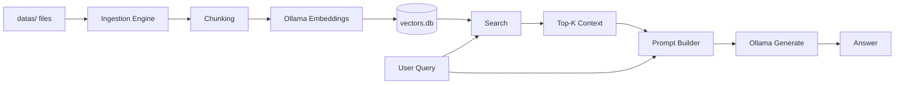
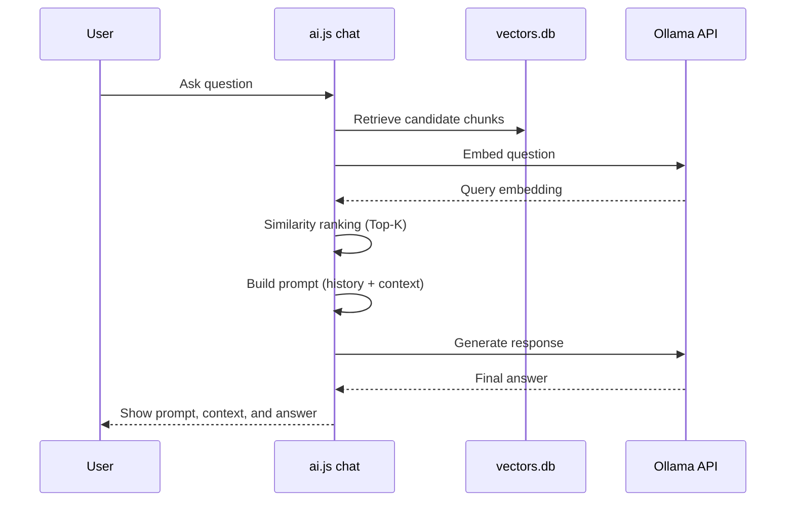

# AI Assistant (Local RAG with Ollama + SQLite)

A local retrieval-augmented generation (RAG) assistant that:
- ingests files from `datas/`
- creates vector embeddings
- stores vectors in `vectors.db`
- retrieves relevant chunks for queries
- runs hybrid retrieval (vector + keyword) for better semantic recall
- sends grounded prompts to a local Ollama model

---

## Architecture



---

## RAG Flow (Chat Mode)



---

## How It Works

### 1) Ingestion
1. Scan files under a selected folder in `datas/` (or all folders).
2. Filter to supported file types (`.md`, `.txt`, `.js`, `.ts`, `.py`, `.json`, `.html`, `.css`, `.yaml`, `.yml`).
3. Chunk each file into ~800 char pieces.
4. Request embeddings from Ollama (`nomic-embed-text`).
5. Insert rows into SQLite table `vectors(file, chunk, embedding)`.

### 2) Search
1. Compute keyword candidates from chunks.
2. Embed the query and compute vector similarity candidates.
3. Normalize and blend both signals into a hybrid score (vector-weighted with keyword support).
4. Return top matches.
5. If embedding is unavailable, fallback to keyword scoring so search still returns useful hits.

### 3) RAG Answering
1. Build a grounded prompt from:
   - top retrieved chunks
   - recent conversation history
   - current user question
2. Send prompt to generation model (`granite3.1-dense:8b`).
3. Return model answer.
4. In `chat` mode, also show:
   - exact prompt sent to the model
   - retrieved context snippets and scores

---

## Setup

## 1. Install dependencies
```bash
npm install
```

## 2. Install and run Ollama
```bash
curl -fsSL https://ollama.com/install.sh | sh
ollama serve
```

## 3. Pull models
```bash
ollama pull nomic-embed-text
ollama pull granite3.1-dense:8b
```

---

## Usage

### Ingest one folder
```bash
node ai.js ingest <folder>
```

### Ingest one folder and reset DB first
```bash
node ai.js ingest <folder> --reset
node ai.js ingest <folder> --reset --strict
```

### Ingest all folders in `datas/`
```bash
node ai.js ingest-all
```

### Ingest all folders and reset DB first
```bash
node ai.js ingest-all --reset
node ai.js ingest-all --reset --strict
```

### Search
```bash
node ai.js search "what is http 404"
```

Search output now includes retrieval method and component scores (hybrid/vector/keyword).

### Chat
```bash
node ai.js chat
```

### Stats
```bash
node ai.js stats
```

### Verify vector integrity
```bash
node ai.js verify-vectors
```

---

## Data Model

SQLite file: `vectors.db`

Table:
- `id` (INTEGER PRIMARY KEY)
- `file` (TEXT)
- `chunk` (TEXT)
- `embedding` (TEXT as JSON array)

---

## Notes

- This project is fully local-first (Ollama + SQLite).
- For large datasets, ingestion can take time depending on CPU/RAM.
- If generation/embedding model loading fails due memory pressure, search falls back to keyword retrieval.
