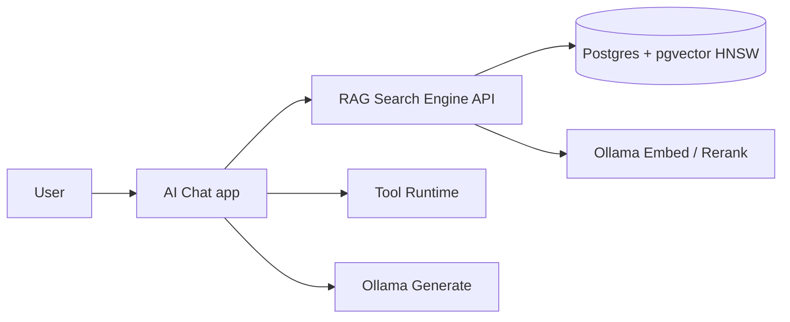

# AI Assistant Platform

This repository is now arranged into clear product folders:

- **`ai-chat/`** → AI Chat app (`app.js`) that uses the retrieval engine and can call tools.
- **`tools/`** → Tooling runtime and tool implementations AI can call.
- **`rag-search-engine/`** → Enterprise retrieval engine (`engine.js`) with Postgres + pgvector + HNSW + optional reranker.

Compatibility launchers remain at root:
- `node engine.js` → starts `rag-search-engine/engine.js`
- `node app.js` → starts `ai-chat/app.js`

## Architecture


## Folder layout

```text
ai-chat/
  app.js
rag-search-engine/
  engine.js
tools/
  index.js
  file-operations.js
  zip-unzip.js
  web-search-scraper.js
  git-tool.js
scripts/
  setup-pgvector.sh
```

## RAG Search Engine APIs

Base URL: `http://localhost:3001`

### `POST /ingest`
```json
{
  "ingest_from": "folder-path | file-path | github-repo-url(.git) | direct text",
  "storage": "tenant_or_project_name",
  "chunk_size": 900,
  "chunk_overlap": 150
}
```

### `POST /query`
```json
{
  "query": "what is http 404",
  "storage": "tenant_or_project_name",
  "top_k": 8,
  "candidate_k": 48,
  "enable_rerank": true
}
```

### Additional
- `GET /storages`
- `GET /health`

## AI-callable tools

AI Chat can call tools via tool-call loop (`TOOL_CALL:{...}`):

1. **`file_operations`**
   - actions: `list`, `read`, `write`, `append`, `copy`, `move`, `delete`, `mkdir`, `stat`
2. **`zip_unzip`**
   - actions: `zip`, `unzip`
3. **`web_search_scraper`**
   - actions: `search`, `scrape`
4. **`git_tool`**
   - actions: `status`, `log`, `branches`

## Setup

### 1) Bootstrap pgvector
```bash
bash scripts/setup-pgvector.sh
source .env.engine
```

### 2) Start Ollama models
```bash
ollama serve
ollama pull nomic-embed-text
ollama pull bge-reranker-base
ollama pull granite3.1-dense:8b
```

### 3) Install and run
```bash
npm install
npm run start      # engine
npm run app        # chat app
```

## Troubleshooting

If you get `password authentication failed for user "postgres"`:

```bash
bash scripts/setup-pgvector.sh
source .env.engine
npm run start
```

Both `rag-search-engine/engine.js` and `ai-chat/app.js` auto-load `.env.engine` when present.
